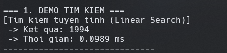
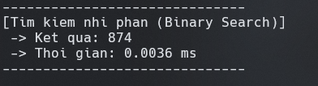
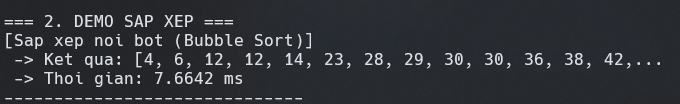
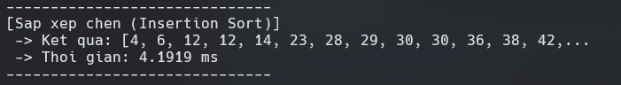
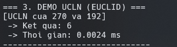

# THUẬT TOÁN MAD101

## 0. Tạo dữ liệu ngẫu nhiên
* *Trước khi chạy các thuật toán, sử dụng thư viện `random` để tạo ngẫu nhiên `n` phần tử (có thể điều chỉnh tại dòng 108 của chương trình).*
* *Demo dưới đây sẽ sử dụng 2000 phần tử cho các thuật toán.*

## 1. Thuật toán tìm kiếm

### 1.1. Linear Search (Tìm kiếm tuyến tính)

### *Giải thích*
* Linear search sẽ tìm kiếm theo danh sách từ đầu đến cuối (0 đến n-1), nếu gặp phần tử bằng giá trị cần tìm (x), trả về vị trí đó.
* Nếu gặp phần tử bằng giá trị cần tìm (x), trả về vị trí đó.

### *Độ phức tạp O(n)*
* Trường hợp tốt nhất: x nằm ở đầu mảng và tìm thấy được luôn.
* Trường hợp xấu nhất: x nằm ở cuối mảng hoặc không có trong mảng, phải so sánh n lần.
### *DEMO:*

### *Tổng thời gian chạy thuật toán: 0.0989ms*

### 1.2. Binary Search (Tìm kiếm nhị phân)

### *Giải thích*
* Thuật toán yêu cầu mảng đã sắp xếp, so sánh `x` với phần tử ở giữa `mid`:
    * Nếu `x < mid`: Tìm tiếp ở nửa bên trái.
    * Nếu `x > mid`: Tìm tiếp ở nửa bên phải.
    * Lặp lại đến khi tìm thấy hoặc hết khoảng tìm kiếm (`return -1`).

### *Độ phức tạp*
* Mỗi lần lặp, không gian tìm kiếm giảm đi một nửa.

### *DEMO*

### *Tổng thời gian chạy thuật toán: 0.0036ms*

## ***KẾT LUẬN: Binary Search nhanh hơn khoảng 27 so với Linear Search***

## 2. Thuật toán sắp xếp

### 2.1. Bubble Sort (Sắp xếp nổi bọt)

### *Giải thích*
* Thuật toán sẽ liên tục hoán đổi hai phần tử liền kề nếu chúng sai thứ tự (số trước lớn hơn số sau). Sau mỗi vòng lặp lớn, phần tử lớn nhất sẽ "nổi" về cuối mảng đúng vị trí.

### *Độ phức tạp: O(n^2).*
* Có 2 vòng lặp lồng nhau. 
* Với 500 phần tử, số phép so sánh vào khoảng 500×500=250,000.

### *DEMO*

### *Tổng thời gian chạy thuật toán: 7.6642ms (thuật toán chậm nhất hiện tại)*

## 2.2. Insertion Sort (Sắp xếp chèn)

### *Giải thích*
* Chia mảng làm 2 phần: đã sắp xếp (bên trái) và chưa sắp xếp (bên phải). 
* Lấy từng phần tử ở phần chưa sắp xếp "chèn" vào đúng vị trí của nó bên phần đã sắp xếp.

### *Độ phức tạp: O(n^2)*
* Cũng có 2 vòng lặp lồng nhau. 
* Tuy nhiên, trong thực tế (trung bình), nó thường nhanh hơn Bubble Sort vì số lần dịch chuyển ít hơn số lần hoán đổi của Bubble Sort.

### *DEMO*

### *Tổng thời gian chạy thuật toán: 4.1919ms*

## ***KẾT LUẬN: Insertion sort ***gần như*** nhanh hơn gấp đôi Bubble sort.***

## 3. Thuật toán Số học (Arithmetic)

## 3.1. Euclidean Algorithm (Tìm UCLN)

### *Giải thích*

* Dựa trên nguyên lý: `GCD(a,b)=GCD(b,a(modb))`. Lặp lại phép chia lấy dư cho đến khi số dư bằng 0.

### *Độ phức tạp: O(log(min(a,b))).*

* Số bước giảm rất nhanh theo cấp số nhân (liên quan đến dãy Fibonacci).

### *DEMO*

### *Tổng thời gian chạy thuật toán: 0.0024ms*

